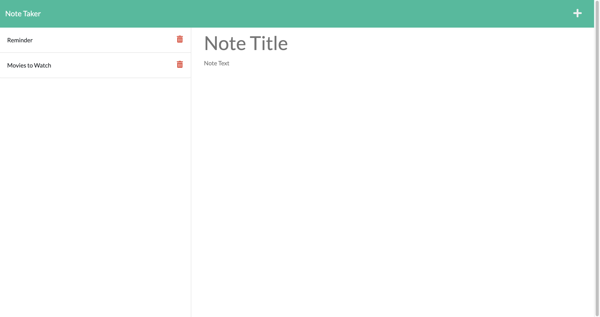

# Express.js : Note Taker


## Description
A web application that can be used to write and save notes. The application uses Express.js on the back end to save and retrieve note data from a JSON file.

## Table of Contents
- [User Story](#user-story)
- [Installation](#installation)
- [Usage](#usage)
- [Screenshots](#screenshots)
- [License](#license)
- [Contributing](#contributing)
- [Questions](#questions)
- [Credits](#credits)

## User Story

```
AS A small business owner
I WANT to be able to write and save notes
SO THAT I can organize my thoughts and keep track of tasks I need to complete
```
## Installation

Please fork this repository over to your local system. 

Once you have forked this repository, please initialize the npm modules into the repository through the command `npm install`. The package.json file holds the necessary dependencies for Node.js and Express.js.

The `server.js` file contains the PORT, middleware, and imports for the required routes. The HTML and API routes are located in the `routes` directory. The `helper` directory contains the function to create unique id's for each saved note.

## Usage

- Complete the installation steps outlined above
- The server.js file contains the methods to initialize database
- Initialize your command-line within the root directory of this repository
- Initialize Node.js by entering `npm start` into your command-line
- Open your browser and navigate to the link provided in your command-line (http://localhost:3001)

### Screenshots




## License
This application is licensed under the MIT license. Please click on the link below to learn more.

https://opensource.org/licenses/MIT

## Contributing

Pull requests are welcome. For major changes, please open an issue first to discuss what you would like to change.

## Questions

Please direct any questions about this project to olivelliott48@gmail.com. If you would like to see more projects, visit the GitHub link below.

https://www.github.com/olivelliott


## Credits

Starter Code: https://github.com/coding-boot-camp/miniature-eureka